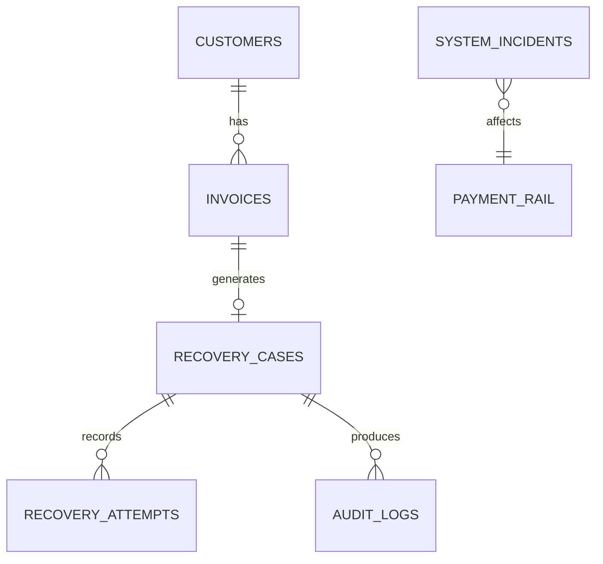

# RECO: Revenue Recovery Control Tower

**Tagline:** *"Recovery isn't about chasing every rupee. It's about knowing which rupee to chase, how hard, and when to stop."*

RECO is an intelligent, deterministic B2B Revenue Recovery Control Tower built for the Razorpay Buildathon. It transforms unstructured recovery attempts into a highly orchestrated, AI-assisted, and guardrail-protected system.

## 3-Minute Demo

1. Dashboard — show Revenue at Risk, Revenue Recovered, Active Cases and Human Review.
2. Select Acme Technologies.
3. Analyze — RECO diagnoses a reliable customer with a short-term delay and compares recovery options.
4. Show expected recovery and recommended WAIT_AND_PAYMENT_LINK.
5. Execute — create the payment link.
6. Explain that creating a payment link does NOT equal recovered revenue; the case remains ACTIVE until payment confirmation.
7. Inject a payment failure — show retry behavior.
8. Second failure → HUMAN_REVIEW.
9. Inject a systemic incident — show automation suppression.
10. Clear the incident — show recovery automation becoming available again.
11. Demonstrate the PAID/DISPUTED guardrail if time permits.

## AI Reliability

Claude is used for diagnosis and recommendation, but never controls execution directly. Every AI recommendation is validated by deterministic policy rules before an action is authorized. If Claude is unavailable, RECO uses a deterministic DEMO FALLBACK so the recovery workflow continues safely.

AI recommendation → policy validation → final authorized action → execution → audit.

## 🏗 System Architecture

RECO is a full-stack web application.

- **Frontend Framework:** React 18 powered by Vite.
- **Routing:** `wouter` for lightweight client-side routing.
- **Styling:** Custom Vanilla CSS and Tailwind-inspired utility classes with a "Precision Ledger" design system (dark mode, glassmorphism, chartreuse/lime accents).
- **Backend:** Node.js with Express.
- **Database:** SQLite3 (using `better-sqlite3`) for extremely fast, synchronous, deterministic data persistence.
- **AI Integration:** `@anthropic-ai/sdk` (Claude) for analyzing unstructured recovery case data (with deterministic fallback).
- **Payment Integration:** Razorpay (simulated payment links generation).

## 🗄 Database Schema (SQLite)

The database (`data/reco.db`) is the single source of truth for the entire application. It uses strict relational constraints.

1. **`customers` Table:**
   - `id`, `name`, `value_tier` (Strategic, High, Medium, Low)
   - `total_invoiced`, `total_recovered`, `average_payment_delay`
   - `prior_payments_ontime`, `prior_failures`, `relationship_risk` (High, Medium, Low)

2. **`invoices` Table:**
   - `id`, `customer_id`, `amount`, `due_date`, `status` (Overdue, Paid, Disputed)
   - `payment_rail` (UPI, Card, Bank Transfer)

3. **`recovery_cases` Table (The Core Entity):**
   - Contains the aggregate snapshot of a recovery event.
   - `invoice_amount`, `days_overdue`, `status` (Ready, Active, Review, Stopped, Failed, Recovered)
   - Guardrail flags: `dispute_flag`, `already_paid_flag`
   - AI outputs: `ai_diagnosis`, `ai_confidence`, `recommended_action`, `expected_recovery`
   - `recovered_amount` for exact financial tracking.

4. **`recovery_attempts` Table:**
   - Tracks individual actions (e.g., sending a payment link, escalating).
   - `action`, `status` (Pending, Success, Failed), `expected_recovery`, `recovered_amount`, `failure_reason`.

5. **`audit_events` Table:**
   - An immutable log of everything happening to a case. 
   - Captures actor (System, RECO AI, Policy Engine, Razorpay).
   - Used to prove deterministic bounds and render the Audit Trail.

6. **`system_incidents` Table:**
   - Simulates external outages (e.g., UPI downtime). When active, forces the engine to bypass AI and halt operations.

## 🧠 The AI and Policy Engine

RECO operates on a hybrid architecture: **Generative AI + Deterministic Guardrails**.

### The Deterministic Guardrails
Before the AI can make a decision (and after it makes a recommendation), the Policy Engine evaluates deterministic rules:
1. **Active Dispute Protection:** If a dispute flag is raised, recovery is STOPPED.
2. **Already Paid Protection:** If already paid, the workflow halts.
3. **Maximum Automated Attempts:** Limits spam. >= 2 attempts forces HUMAN REVIEW.
4. **Uneconomical Recovery:** If Expected Recovery < Intervention Cost, STOP.
5. **Systemic Incident Suppression:** If UPI/Card networks are down, suppress automated recovery to prevent customer frustration.
6. **Reliable Customer Delay:** If the customer is highly reliable and only slightly overdue, wait and quietly issue a payment link rather than escalating aggressively.

### The AI Engine
When guardrails allow, Claude analyzes the case:
- It evaluates the customer's `value_tier`, `days_overdue`, `prior_failures`, and `payment_rail`.
- It outputs a semantic `diagnosis` (e.g., "Customer has historically paid reliably but current payment rail shows elevated failure risk").
- It selects an optimal `recommended_action` (e.g., WAIT_AND_PAYMENT_LINK, REMINDER, ESCALATE).
- It calculates an `expected_recovery` value based on probabilities.
- **Crucial Feature:** If the Anthropic API goes down or the API key is missing, RECO falls back to a purely deterministic rule tree, ensuring the dashboard never breaks during the pitch.

## 📊 The Canonical 20-Case Dataset

To make the demo perfect, the application is strictly seeded with exactly 20 B2B cases when the server boots.

- **Total Revenue at Risk:** Exactly ₹18,60,000 (₹18.6L)
- **Total Revenue Recovered:** Exactly ₹11,40,000 (₹11.4L)
- **Recovery Rate:** Exactly 61.3%
- **Status Distribution:** 11 Recovered, 2 Active, 4 Human Review, 3 Stopped.

Every single metric on the dashboard is derived dynamically via `SUM(invoice_amount)` and `SUM(recovered_amount)` across these 20 cases. No fake counters exist.

### The Acme Technologies Hero Case
- **Invoice:** INV-2026-1042 for ₹2,40,000.
- **Scenario:** Strategic account, 2 days overdue, 5/5 prior payments on time, no failures.
- **AI Recommendation:** `WAIT + PAYMENT LINK` (Expected Recovery: ~₹1.73L).
- **Reasoning:** Calling them immediately risks the relationship. Waiting a day and quietly sending a Razorpay Payment Link yields the highest expected value.

## 🖥 User Interface & Pages

1. **Dashboard (`/`)**
   - Core KPIs (18.6L at risk, 11.4L recovered, Active Cases, Stopped Cases).
   - **Priority Cases Queue**: A ranked table of the highest priority cases (Acme at the top).
   - **System Health Mini-panel**: Live API latency and incident detection.

2. **Recovery Cases (`/cases`)**
   - A searchable, filtered table of all 20 canonical cases.
   - Shows the specific AI decision and the exact Expected Recovery amount.

3. **Recoveries (`/recoveries`)**
   - Focuses purely on the successes.
   - Calculates **Variance**: `(Actual Recovered Amount - AI Forecasted Amount)`. This proves to the user that the AI is making accurate financial predictions.

4. **Customers (`/customers`)**
   - Aggregates cases up to the customer level.
   - Shows a "Reliability %" derived from `prior_payments_ontime / (ontime + failures)`.

5. **System Health (`/system`)**
   - Displays execution stats (how many recovery attempts have succeeded/failed).
   - **Incident Simulator:** Contains a button to deliberately inject a "Systemic Incident" (e.g., Card Network failure). Doing so suppresses the automation engine globally, demonstrating the guardrails in action.

6. **Audit Trail (`/audit`)**
   - The master ledger. 
   - Proves exactly what actor (System vs. AI vs. Policy Engine) made what decision, at what millisecond.

7. **Rules (`/rules`)**
   - A visual display of the 6 core deterministic policies governing the system.

## 🚀 How to Run

1. `npm install`
2. `npm run build` (Builds the React frontend into `dist/public` and the Node backend into `dist/index.js`)
3. `npm run dev` (Starts the backend on port 3001 and the Vite dev server) OR `node dist/index.js` (Starts the production server).
4. The database `data/reco.db` will automatically seed the 20 cases upon startup if it doesn't exist. To reseed, simply delete the `data` folder and restart the server.
